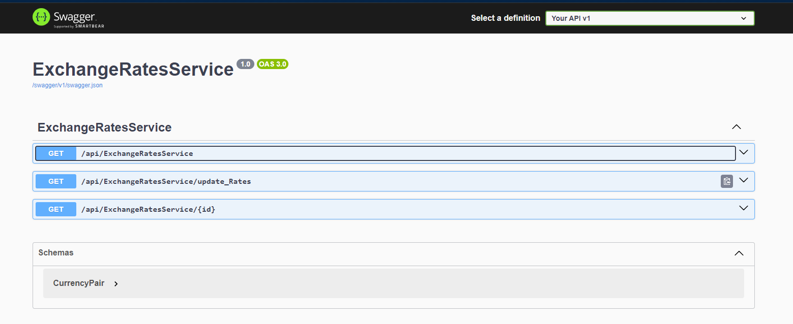

# AUDCurrency
Store and display AUD currency pair 

## How to start currency project
### Ports Checking
| **Service**  | **URL**                                                            |
|--------------|--------------------------------------------------------------------|
| pgAdmin      | [localhost:8888](http://localhost:8888)                            |
| SwaggerApi   | [Swagger](http://localhost:5151)                    |
| Postgres     | [localhost:5432](http://localhost:5432/)                          |

### To review all available api operations:
[localhost:5151](http://localhost:5151)

### To view all saved currency data

- Option 1
    Simple click /api/ExchangeRatesService shown as above

- Option 2
    open a brwoser, url: http://localhost:5151/api/ExchangeRatesService

### To trigger a fetch action
- Option 1
    Simple click GET /api/ExchangeRatesService/update_Rates
- Option 2
    open a brwoser, url: http://localhost:5151/api/ExchangeRatesService/update_Rates

### To review single record from db
- Option 1:
    Simple click GET /api/ExchangeRatesService/{id}
- Option 2:
    http://localhost:5151/api/ExchangeRatesService/id
    e.g. http://localhost:5151/api/ExchangeRatesService/46

## To interacte with database via pgadmin

open a browser, url: localhost:8888

<details> 

   <summary> Click to show user credentials </summary>

    The username and password for pgadmin: 

    - userName: user@dogtainers.com.au
    - passWord: user


    The user name and password for connecting to db
 
    - user: dogtainers
    - password: dogtainers
</details>

### To start up the backend 
```
    cd audBackEnd
    dotnet run dev
```

### To install and start up frontEnd 
```
    cd audapp
    npm install
    npm run dev
```
### To start up postgres DB within docker compose

```
    docker compose -f compose.yml up --build
```

### To generate controller base on model and db context
```
    dotnet aspnet-codegenerator controller -name CurrencyController -async -api -m CurrencyItem -dc CurrenciesDBContext -outDir Controllers
```

### To update dababase
```
    dotnet ef database update
```

### Fetch public api for currency 
<details>

<summary> AUD exchange rate fetch api  </summary>

    https://api.freecurrencyapi.com/v1/currencies?apikey=fca_live_fcxICI1hMR8xzFktbwu0P9mDaJlCwwgHpcHhiUsY&currencies=&base_currency=AUD

    https://api.currencyapi.com/v3/latest?apikey=fca_live_fcxICI1hMR8xzFktbwu0P9mDaJlCwwgHpcHhiUsY&base_currency=AUD
    
    https://app.freecurrencyapi.com/dashboard
</details>

### Init data
```
[
  {
    "id": 1,
    "timestamp": 1723688358,
    "name": "Chinese",
    "moneyCode": "CNY",
    "baseValue": 1,
    "value": 4.776
  },
  {
    "id": 2,
    "timestamp": 1723688338,
    "name": "Japanese",
    "moneyCode": "JPY",
    "baseValue": 1,
    "value": 430
  }
]
```


## Requirement and Progress

### Structure
- Nextjs pages api front end
- .net 8 api back end
- Communication from front to backend using **hot chocolate** graphql plus js fetch api (or a dedicated gql client)
- A docker compose file to run the whole thing
- Communication with a public (and free) exchange rates api
- Postgres database for storage
 
### Function Requirements
- Display (using react and next js pages api) the current exchange rates for various AUD currency pairs, requested from your .net api via graphql. You'll need to find a public api to get this data from.
 
- Store these rates in the database using entity framework, and update them each hour on an interval.
 
- Add a **button** to the ui to manually refresh the exchange rates, using a graphql request. This must get the .Net api to request the latest rates and then display them.
 
- You must display a timestamp in the ui showing when the rates were last updated.
 
 ### Todo Next
- <s>Add requirements to readme doc</s>

- <s>create database and connection via compose file instead of manually operator on pgadmin</s>

- Name convention

   <s> - Create an 'ExchangeRatesService' class with the method 'UpdateRates'. This should call a public exchange rates API to get a variety of AUD/X currency pairs, eg AUD/GBP and adds them as rows into your database in a table called 'exchangeRates'. The method should return a list of each currency pair and their exchange rate. eg [["AUDUSD", 0.66],["AUD/GBP", 0.51]]

    - Create a single controller called 'ExchangeRatesController' with the route 'UpdateRates' that instantiates an instance of the ExchangeRatesService and calls exchangeRatesService.UpdateRates() and returns its result (the list of pairs + exchange rates)</s>

- Error Handler

- Hourly reFetch triggerh

- Check data not same every fetch

- About timestamp

-  <s>Find a way to call the ExchangeRatesController.UpdateRates controller route from your browser, ideally via the swagger docs that .net can auto generate for you. **Document** how to view this in your repo. </s>

- And then once you are done, the next step may take you a while. Add the **'Hot Chocolate'** package to your API. Read its documentation and figure out how to call ExchangeRatesService.UpdateRates() via a mutation, and how to test it in your browser using https://graphql-dotnet.github.io/docs/getting-started/graphiql/ or similar.